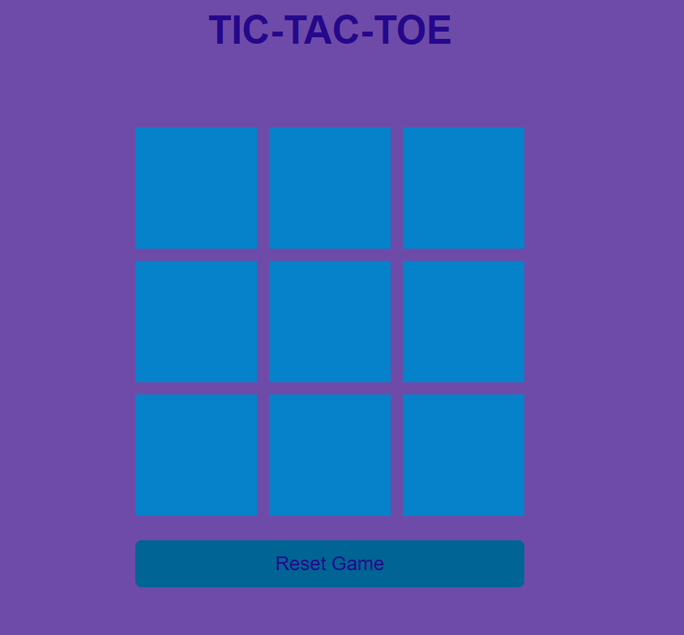
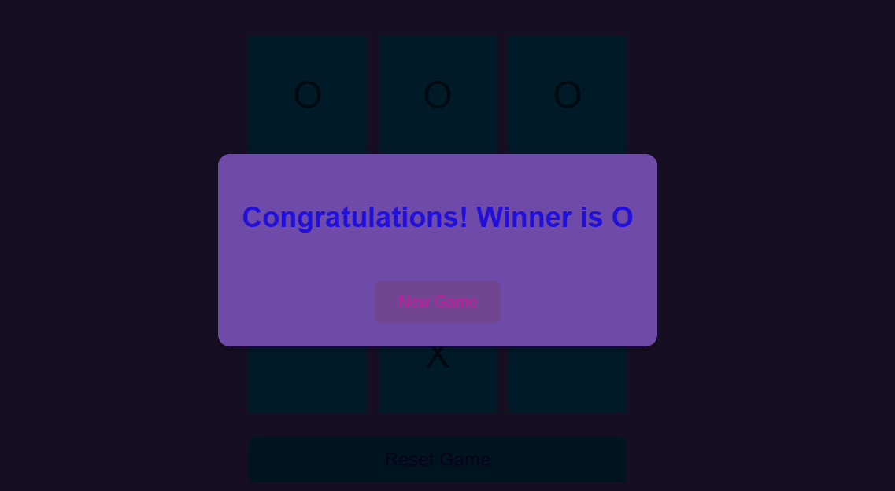

# 🎮 Tic-Tac-Toe Game

A simple web-based **Tic-Tac-Toe** game built with **HTML**, **CSS**, and **JavaScript**. This game allows two players to take turns and shows a winner message with an option to reset the game.

---

## 📁 Project Structure

```
TIC-TAC-TOE/
│
├── images/
│   ├── first.png         # Optional: Starting screen image
│   └── winner.png        # Optional: Winner screen image
│
├── index.html            # Main HTML file
├── style.css             # Styling for the game
├── app.js                # JavaScript logic
```

---

## 🚀 Features

- Simple 3x3 grid-based game
- Two-player mode (O and X)
- Detects win conditions and shows the winner
- Reset and New Game functionality
- Styled with a colorful and user-friendly interface

---

## 🛠️ How to Run

1. **Download or Clone the Repository**
   ```bash
   git clone https://github.com/your-username/tic-tac-toe.git
   cd tic-tac-toe
   ```

2. **Open `index.html` in a browser**
   - You can simply double-click the `index.html` file
   - Or right-click and select **"Open with Live Server"** (if using VS Code)

---

## 🖼️ Screenshots


*Start screen preview*


*Winner announcement screen*

---

## 📜 Technologies Used

- **HTML** – structure
- **CSS** – styling and layout
- **JavaScript** – game logic and interactions

---

## 🧠 Game Logic

- Game uses an array of winning patterns.
- Each box is clickable once and alternates between "O" and "X".
- After every move, it checks for a win.
- Winner is displayed with an overlay and a reset button.

---

## 🔄 Reset Game

There are two buttons to reset:
- **Reset Game** – restarts the current game
- **New Game** – clears the winner screen and allows a new round

---

## 📌 Future Improvements (Optional Ideas)

- Add single-player mode vs computer (AI)
- Add sound effects
- Add animations when a player wins
- Save game history

---

## 🧑‍💻 Author

Developed by **[Your Name Here]**

---

## 📄 License

This project is licensed under the MIT License - feel free to use and modify!
