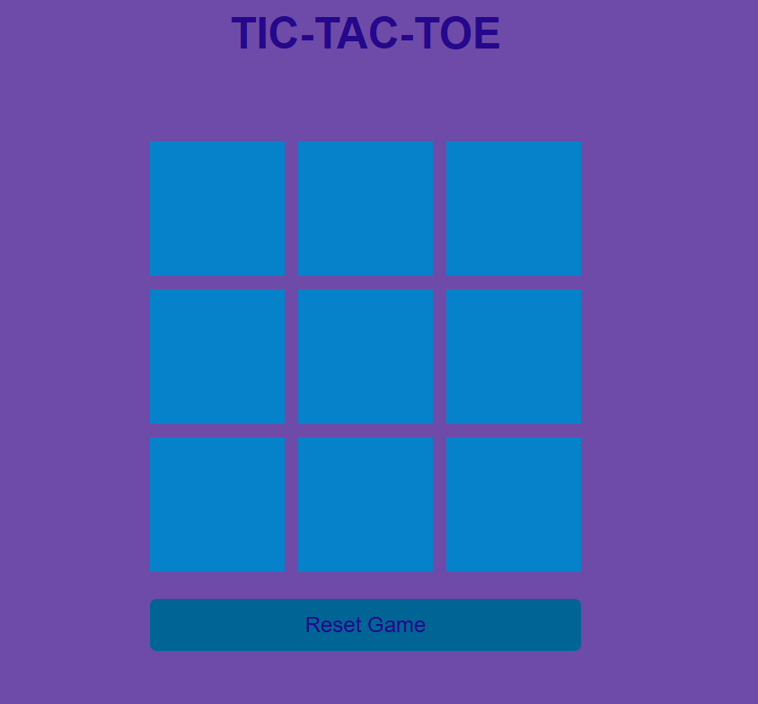
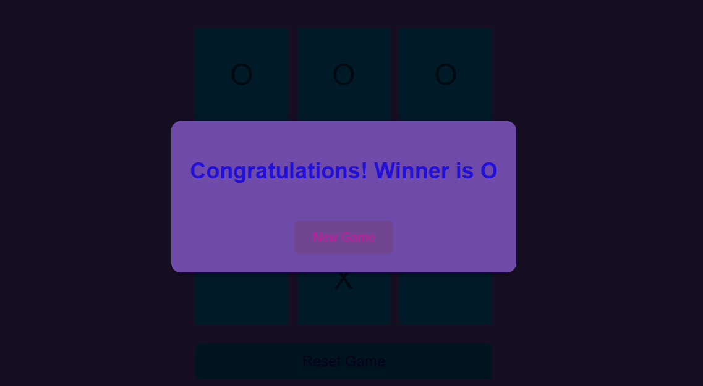

# 🧠 Tic-Tac-Toe Game

A simple **Tic-Tac-Toe** (X and O) game built with **HTML**, **CSS**, and **JavaScript**. This game allows two players to compete in turns on a 3x3 board. The first player to align 3 marks (X or O) in a row, column, or diagonal wins!

---

## 📸 Screenshot

### Game Board  


### Winner Screen  


---

## 🎮 Features

- ✅ Two-player mode
- ✅ Interactive UI with clickable boxes
- ✅ Win and draw detection
- ✅ Game reset functionality
- ✅ Winner highlight and message display
- ✅ Responsive design

---

## 💡 How to Use

### 1. Clone the Repository
```bash
git clone https://github.com/Jyoti-Adhikari/tic-tac-toe.git
```

### 2. Navigate to the Project Folder
```bash
cd tic-tac-toe
```

### 3. Open `index.html`
You can double-click `index.html` or right-click and choose **"Open with browser"** to play the game.

---

## 📁 Project Structure

```
tic-tac-toe/
├── index.html         # Main HTML file
├── style.css          # Stylesheet
├── app.js             # Game logic
├── .gitignore         # Git ignore rules
├── README.md          # Project documentation
└── images/
    ├── first.png      # Game board image
    └── winner.png     # Winner celebration image
```

---

## 🛠️ Technologies Used

- HTML5
- CSS3
- JavaScript (Vanilla)

---

## 🚀 Live Demo

> ⚠️ Add GitHub Pages link here if hosted  
Example: https://jyoti-adhikari.github.io/tic-tac-toe/

---

## 📌 Future Improvements

- Add single-player mode with AI
- Add score tracking
- Add animations and sound effects

---

## 🙋‍♀️ Author

**Jyoti Adhikari**  
GitHub: [@Jyoti-Adhikari](https://github.com/Jyoti-Adhikari)

---

## 📝 License

This project is open-source and available under the [MIT License](https://choosealicense.com/licenses/mit/).
